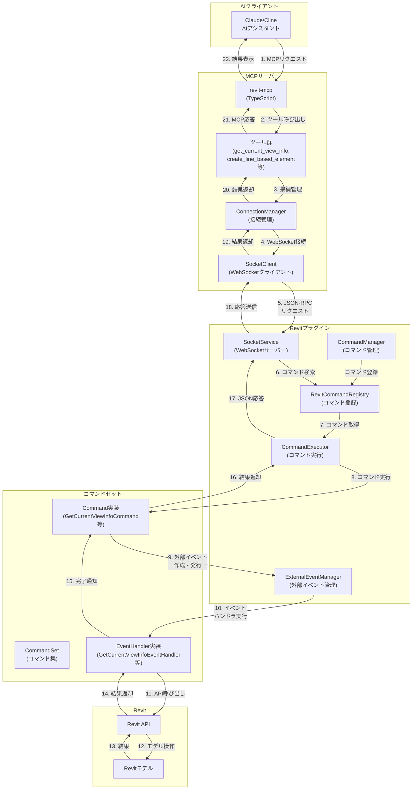
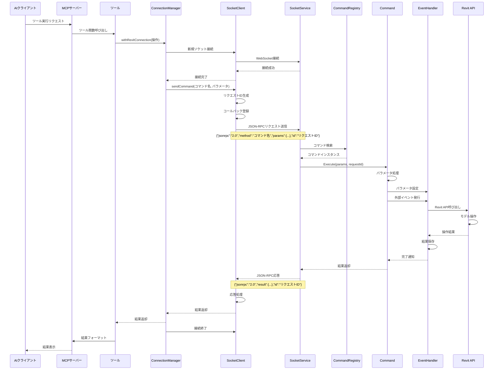
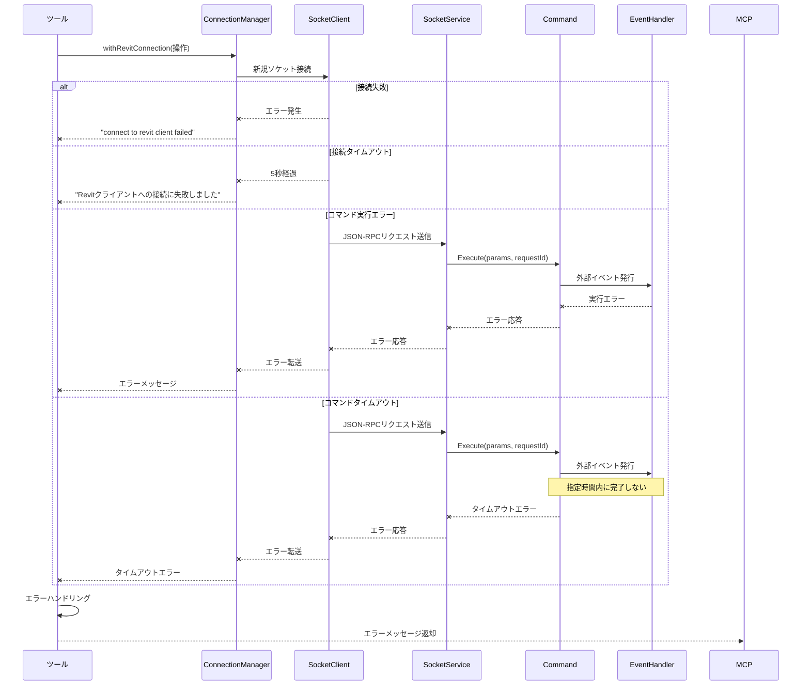

# Revit-MCP プロジェクト詳細分析

## 📑 概要

Revit-MCPは、Autodesk Revit（建築・構造・設備設計用BIMソフトウェア）とAIアシスタント（Claude、Clineなど）をModel Context Protocol（MCP）を通じて連携させるためのプロジェクトです。このプロジェクトにより、AIがRevitプロジェクトのデータにアクセスし、Revit内の要素を作成・修正・削除するなどの操作を行うことが可能になります。

このプロジェクトは主に2つのコンポーネントから構成されています：
1. **revit-mcp** (TypeScript): AIアシスタントにツールを提供するMCPサーバー
2. **revit-mcp-plugin** (C#): Revitプラグイン側の実装で、実際にRevitを操作する

## 🗂️ プロジェクト構成

### revit-mcp (MCPサーバー)

```
revit-mcp/
├── src/
│   ├── index.ts                  # メインエントリーポイント
│   ├── tools/                    # Revit操作ツール群
│   │   ├── register.ts           # ツール登録機能
│   │   ├── get_current_view_info.ts
│   │   ├── get_current_view_elements.ts
│   │   ├── get_selected_elements.ts
│   │   ├── get_available_family_types.ts
│   │   ├── create_point_based_element.ts
│   │   ├── create_line_based_element.ts
│   │   ├── create_surface_based_element.ts
│   │   ├── createWall.ts
│   │   ├── delete_element.ts
│   │   ├── modify_element.ts
│   │   ├── color_elements.ts
│   │   ├── tag_all_walls.ts
│   │   ├── search_modules.ts
│   │   ├── use_module.ts
│   │   └── send_code_to_revit.ts
│   └── utils/                    # ユーティリティ
│       ├── ConnectionManager.ts  # Revit接続管理
│       └── SocketClient.ts       # WebSocket通信
├── package.json                  # プロジェクト設定
└── tsconfig.json                 # TypeScript設定
```

### revit-mcp-plugin (Revitプラグイン)

```
revit-mcp-plugin/
├── revit-mcp-plugin/
│   ├── Configuration/                      # 設定管理
│   │   ├── CommandConfig.cs                # コマンド設定
│   │   ├── ConfigurationManager.cs         # 設定マネージャー
│   │   ├── DeveloperInfo.cs                # 開発者情報
│   │   ├── FrameworkConfig.cs              # フレームワーク設定
│   │   └── ServiceSettings.cs              # サービス設定
│   │
│   ├── Core/                               # コア機能
│   │   ├── Application.cs                  # アプリケーションエントリーポイント
│   │   ├── CommandExecutor.cs              # コマンド実行
│   │   ├── CommandManager.cs               # コマンド管理
│   │   ├── ExternalEventManager.cs         # 外部イベント管理
│   │   ├── MCPServiceConnection.cs         # MCPサービス接続
│   │   ├── RevitCommandRegistry.cs         # Revitコマンド登録
│   │   ├── Settings.cs                     # 設定
│   │   └── SocketService.cs                # ソケットサービス
│   │
│   ├── Models/                             # データモデル
│   │   ├── AIResult.cs                     # AI結果
│   │   ├── JZFace.cs                       # 面データ
│   │   ├── JZLine.cs                       # 線データ
│   │   ├── JZPoint.cs                      # 点データ
│   │   ├── LineElement.cs                  # 線要素
│   │   ├── PointElement.cs                 # 点要素
│   │   └── SurfaceElement.cs               # 面要素
│   │
│   ├── UI/                                 # ユーザーインターフェース
│   │   ├── CommandSetSettingsPage.xaml     # コマンドセット設定ページ
│   │   ├── CommandSetSettingsPage.xaml.cs  # コマンドセット設定ページコード
│   │   ├── SettingsWindow.xaml             # 設定ウィンドウ
│   │   └── SettingsWindow.xaml.cs          # 設定ウィンドウコード
│   │
│   └── Utils/                              # ユーティリティ
│       ├── Logger.cs                       # ロギング
│       └── PathManager.cs                  # パス管理
│
├── SampleCommandSet/                       # サンプルコマンドセット
│   ├── Commands/                           # コマンド実装
│   │   ├── Access/                         # データアクセスコマンド
│   │   │   ├── GetCurrentViewInfoCommand.cs
│   │   │   ├── GetCurrentViewInfoEventHandler.cs
│   │   │   ├── GetCurrentViewElementsCommand.cs
│   │   │   ├── GetCurrentViewElementsEventHandler.cs
│   │   │   ├── GetSelectedElementsCommand.cs
│   │   │   ├── GetSelectedElementsEventHandler.cs
│   │   │   ├── GetAvailableFamilyTypesCommand.cs
│   │   │   └── GetAvailableFamilyTypesEventHandler.cs
│   │   │
│   │   ├── Create/                         # 作成コマンド
│   │   │   ├── CreateWallCommand.cs
│   │   │   └── CreateWallEventHandler.cs
│   │   │
│   │   ├── Delete/                         # 削除コマンド
│   │   │   ├── DeleteElementCommand.cs
│   │   │   └── DeleteElementEventHandler.cs
│   │   │
│   │   └── Test/                           # テストコマンド
│   │       ├── SayHelloCommand.cs
│   │       └── SayHelloEventHandler.cs
│   │
│   ├── Extensions/                         # 拡張機能
│   │   └── RevitApiCompatibilityExtensions.cs
│   │
│   ├── Models/                             # データモデル
│   │   ├── FamilyTypeInfo.cs
│   │   ├── Point.cs
│   │   ├── ViewInfo.cs
│   │   └── WallInfo.cs
│   │
│   └── command.json                        # コマンド設定ファイル
```

## 🔍 コード詳細分析

### 1. MCPサーバー側 (revit-mcp)

#### メインエントリーポイント (index.ts)

```typescript
// MCPサーバーの初期化と起動
const server = new McpServer({
  name: "revit-mcp",
  version: "1.0.0",
});

// ツールの登録と起動
async function main() {
  await registerTools(server);
  const transport = new StdioServerTransport();
  await server.connect(transport);
  console.error("Revit MCP Server start success");
}
```

このコードは、MCPサーバーを初期化し、ツールを登録して、標準入出力（stdio）を通じてAIクライアントと通信を開始します。エラーが発生した場合は、エラーメッセージを表示して終了します。

#### ツール登録メカニズム (register.ts)

```typescript
// ツールディレクトリ内のファイルを動的に読み込み、登録する
export async function registerTools(server: McpServer) {
  const __dirname = path.dirname(fileURLToPath(import.meta.url));
  const files = fs.readdirSync(__dirname);
  
  // .tsまたは.jsファイルを抽出（index.tsとregister.tsを除く）
  const toolFiles = files.filter(
    (file) =>
      (file.endsWith(".ts") || file.endsWith(".js")) &&
      file !== "index.ts" &&
      file !== "index.js" &&
      file !== "register.ts" &&
      file !== "register.js"
  );

  // 各ツールファイルを動的にインポートして登録
  for (const file of toolFiles) {
    try {
      const importPath = `./${file.replace(/\.(ts|js)$/, ".js")}`;
      const module = await import(importPath);
      
      // register*という名前の関数を探して実行
      const registerFunctionName = Object.keys(module).find(
        (key) => key.startsWith("register") && typeof module[key] === "function"
      );

      if (registerFunctionName) {
        module[registerFunctionName](server);
        console.error(`ツール登録: ${file}`);
      } else {
        console.warn(`警告: ファイル ${file} に登録関数が見つかりません`);
      }
    } catch (error) {
      console.error(`ツール登録エラー ${file}:`, error);
    }
  }
}
```

このコードは、`tools`ディレクトリ内のすべてのツールファイルを動的に読み込み、各ファイル内の`register`で始まる関数を実行してツールをMCPサーバーに登録します。これにより、新しいツールを追加する際に、単にファイルを追加するだけで自動的に登録されるようになっています。

#### Revit接続管理 (ConnectionManager.ts)

```typescript
// Revitクライアントとの接続を管理し、操作を実行する
export async function withRevitConnection<T>(
  operation: (client: RevitClientConnection) => Promise<T>
): Promise<T> {
  const revitClient = new RevitClientConnection("localhost", 8080);

  try {
    // Revitクライアントに接続
    if (!revitClient.isConnected) {
      await new Promise<void>((resolve, reject) => {
        // 接続イベントハンドラ
        const onConnect = () => {
          revitClient.socket.removeListener("connect", onConnect);
          revitClient.socket.removeListener("error", onError);
          resolve();
        };

        // エラーイベントハンドラ
        const onError = (error: any) => {
          revitClient.socket.removeListener("connect", onConnect);
          revitClient.socket.removeListener("error", onError);
          reject(new Error("connect to revit client failed"));
        };

        // イベントリスナーを設定して接続
        revitClient.socket.on("connect", onConnect);
        revitClient.socket.on("error", onError);
        revitClient.connect();

        // 5秒後にタイムアウト
        setTimeout(() => {
          revitClient.socket.removeListener("connect", onConnect);
          revitClient.socket.removeListener("error", onError);
          reject(new Error("Revitクライアントへの接続に失敗しました"));
        }, 5000);
      });
    }

    // 操作を実行
    return await operation(revitClient);
  } finally {
    // 接続を閉じる
    revitClient.disconnect();
  }
}
```

このコードは、Revitプラグインとの接続を管理するためのユーティリティを提供しています。`withRevitConnection`関数は、Revitクライアントへの接続を確立し、操作を実行した後、接続を閉じる処理を自動的に行います。接続に失敗した場合や5秒以内に接続できない場合はエラーを返します。

#### WebSocket通信 (SocketClient.ts)

```typescript
// Revitクライアントとの通信を担当するクラス
export class RevitClientConnection {
  // プロパティ
  host: string;
  port: number;
  socket: net.Socket;
  isConnected: boolean = false;
  responseCallbacks: Map<string, (response: string) => void> = new Map();
  buffer: string = "";

  // コマンドを送信し、応答を待機するメソッド
  public sendCommand(command: string, params: any = {}): Promise<any> {
    return new Promise((resolve, reject) => {
      try {
        if (!this.isConnected) {
          this.connect();
        }

        // リクエストIDを生成
        const requestId = this.generateRequestId();

        // JSON-RPCリクエストを作成
        const commandObj = {
          jsonrpc: "2.0",
          method: command,
          params: params,
          id: requestId,
        };

        // コールバックを登録
        this.responseCallbacks.set(requestId, (responseData) => {
          try {
            const response = JSON.parse(responseData);
            if (response.error) {
              reject(
                new Error(response.error.message || "Unknown error from Revit")
              );
            } else {
              resolve(response.result);
            }
          } catch (error) {
            // パース失敗時のエラーハンドリング
            if (error instanceof Error) {
              reject(new Error(`Failed to parse response: ${error.message}`));
            } else {
              reject(new Error(`Failed to parse response: ${String(error)}`));
            }
          }
        });

        // コマンドを送信
        const commandString = JSON.stringify(commandObj);
        this.socket.write(commandString);

        // 2分後にタイムアウト
        setTimeout(() => {
          if (this.responseCallbacks.has(requestId)) {
            this.responseCallbacks.delete(requestId);
            reject(new Error(`Command timed out after 2 minutes: ${command}`));
          }
        }, 120000);
      } catch (error) {
        reject(error);
      }
    });
  }
}
```

このクラスは、Revitプラグインとの通信を担当するWebSocketクライアントを実装しています。JSON-RPCプロトコルを使用して、コマンドの送信と応答の処理を行います。各コマンドには一意のIDが割り当てられ、応答が返ってくるまで待機します。2分以内に応答がない場合はタイムアウトエラーを返します。

#### ツール実装例 (create_line_based_element.ts)

```typescript
// 線ベースの要素（壁、梁、配管など）を作成するツール
export function registerCreateLineBasedElementTool(server: McpServer) {
  server.tool(
    "create_line_based_element",
    "Create one or more line-based elements in Revit such as walls, beams, or pipes...",
    {
      data: z
        .array(
          z.object({
            name: z
              .string()
              .describe("Description of the element (e.g., wall, beam)"),
            typeId: z
              .number()
              .optional()
              .describe("The ID of the family type to create."),
            locationLine: z
              .object({
                p0: z.object({
                  x: z.number().describe("X coordinate of start point"),
                  y: z.number().describe("Y coordinate of start point"),
                  z: z.number().describe("Z coordinate of start point"),
                }),
                p1: z.object({
                  x: z.number().describe("X coordinate of end point"),
                  y: z.number().describe("Y coordinate of end point"),
                  z: z.number().describe("Z coordinate of end point"),
                }),
              })
              .describe("The line defining the element's location"),
            // その他のパラメータ...
          })
        )
        .describe("Array of line-based elements to create"),
    },
    async (args, extra) => {
      try {
        // Revitクライアントに接続してコマンドを実行
        const response = await withRevitConnection(async (revitClient) => {
          return await revitClient.sendCommand(
            "create_line_based_element",
            args
          );
        });

        // 成功時のレスポンス
        return {
          content: [
            {
              type: "text",
              text: JSON.stringify(response, null, 2),
            },
          ],
        };
      } catch (error) {
        // エラー時のレスポンス
        return {
          content: [
            {
              type: "text",
              text: `Create line-based element failed: ${
                error instanceof Error ? error.message : String(error)
              }`,
            },
          ],
        };
      }
    }
  );
}
```

このコードは、線ベースの要素（壁、梁、配管など）を作成するためのツールを実装しています。zodライブラリを使用してパラメータのスキーマを定義し、Revitクライアントに接続してコマンドを実行します。成功時は結果をJSON形式で返し、失敗時はエラーメッセージを返します。

### 2. Revitプラグイン側 (revit-mcp-plugin)

#### アプリケーションエントリーポイント (Application.cs)

```csharp
public class Application : IExternalApplication
{
    public Result OnStartup(UIControlledApplication application)
    {
        // Revitリボンパネルの作成
        RibbonPanel mcpPanel = application.CreateRibbonPanel("Revit MCP Plugin");

        // MCPサービス接続ボタンの追加
        PushButtonData pushButtonData = new PushButtonData("ID_EXCMD_TOGGLE_REVIT_MCP", "Revit MCP\r\n Switch",
            Assembly.GetExecutingAssembly().Location, "revit_mcp_plugin.Core.MCPServiceConnection");
        pushButtonData.ToolTip = "Open / Close mcp server";
        pushButtonData.Image = new BitmapImage(new Uri("/revit-mcp-plugin;component/Core/Ressources/icon-16.png", UriKind.RelativeOrAbsolute));
        pushButtonData.LargeImage = new BitmapImage(new Uri("/revit-mcp-plugin;component/Core/Ressources/icon-32.png", UriKind.RelativeOrAbsolute));
        mcpPanel.AddItem(pushButtonData);

        // 設定ボタンの追加
        PushButtonData mcp_settings_pushButtonData = new PushButtonData("ID_EXCMD_MCP_SETTINGS", "Settings",
            Assembly.GetExecutingAssembly().Location, "revit_mcp_plugin.Core.Settings");
        mcp_settings_pushButtonData.ToolTip = "MCP Settings";
        mcp_settings_pushButtonData.Image = new BitmapImage(new Uri("/revit-mcp-plugin;component/Core/Ressources/settings-16.png", UriKind.RelativeOrAbsolute));
        mcp_settings_pushButtonData.LargeImage = new BitmapImage(new Uri("/revit-mcp-plugin;component/Core/Ressources/settings-32.png", UriKind.RelativeOrAbsolute));
        mcpPanel.AddItem(mcp_settings_pushButtonData);

        return Result.Succeeded;
    }

    public Result OnShutdown(UIControlledApplication application)
    {
        // ソケットサービスが実行中の場合は停止
        try
        {
            if (SocketService.Instance.IsRunning)
            {
                SocketService.Instance.Stop();
            }
        }
        catch { }

        return Result.Succeeded;
    }
}
```

このコードは、Revitプラグインのエントリーポイントを実装しています。Revitの起動時にリボンパネルとボタンを作成し、シャットダウン時にソケットサービスを停止します。

#### ソケットサービス (SocketService.cs)

```csharp
public class SocketService
{
    private static SocketService _instance;
    private TcpListener _listener;
    private Thread _listenerThread;
    private bool _isRunning;
    private int _port = 8080;
    private UIApplication _uiApp;
    private ICommandRegistry _commandRegistry;
    private ILogger _logger;
    private CommandExecutor _commandExecutor;

    // シングルトンインスタンス
    public static SocketService Instance
    {
        get
        {
            if(_instance == null)
                _instance = new SocketService();
            return _instance;
        }
    }

    // 初期化
    public void Initialize(UIApplication uiApp)
    {
        _uiApp = uiApp;

        // 外部イベント管理の初期化
        ExternalEventManager.Instance.Initialize(uiApp, _logger);

        // Revitバージョンの記録
        var versionAdapter = new revit_mcp_sdk.API.Versioning.RevitVersionAdapter(_uiApp.Application);
        string currentVersion = versionAdapter.GetRevitVersion();
        _logger.Info("現在のRevitバージョン: {0}", currentVersion);

        // コマンド実行器の作成
        _commandExecutor = new CommandExecutor(_commandRegistry, _logger);

        // 設定の読み込みとコマンドの登録
        ConfigurationManager configManager = new ConfigurationManager(_logger);
        configManager.LoadConfiguration();
        
        // ポート設定（固定8080）
        _port = 8080;

        // コマンドの読み込み
        CommandManager commandManager = new CommandManager(
            _commandRegistry, _logger, configManager, _uiApp);
        commandManager.LoadCommands();

        _logger.Info($"ソケットサービスを初期化しました（ポート: {_port}）");
    }

    // サービス開始
    public void Start()
    {
        if (_isRunning) return;

        try
        {
            _isRunning = true;
            _listener = new TcpListener(IPAddress.Any, _port);
            _listener.Start();

            _listenerThread = new Thread(ListenForClients)
            {
                IsBackground = true
            };
            _listenerThread.Start();              
        }
        catch (Exception ex)
        {
            _isRunning = false;
        }
    }

    // クライアント接続待機
    private void ListenForClients()
    {
        try
        {
            while (_isRunning)
            {
                TcpClient client = _listener.AcceptTcpClient();

                Thread clientThread = new Thread(HandleClientCommunication)
                {
                    IsBackground = true
                };
                clientThread.Start(client);
            }
        }
        catch (SocketException)
        {
            
        }
        catch(Exception ex)
        {
            // ログ
        }
    }

    // クライアント通信処理
    private void HandleClientCommunication(object clientObj)
    {
        TcpClient tcpClient = (TcpClient)clientObj;
        NetworkStream stream = tcpClient.GetStream();

        try
        {
            byte[] buffer = new byte[8192];

            while (_isRunning && tcpClient.Connected)
            {
                // クライアントからのメッセージ読み取り
                int bytesRead = 0;

                try
                {
                    bytesRead = stream.Read(buffer, 0, buffer.Length);
                }
                catch (IOException)
                {
                    // クライアント切断
                    break;
                }

                if (bytesRead == 0)
                {
                    // クライアント切断
                    break;
                }

                string message = Encoding.UTF8.GetString(buffer, 0, bytesRead);
                System.Diagnostics.Trace.WriteLine($"メッセージ受信: {message}");

                string response = ProcessJsonRPCRequest(message);

                // レスポンス送信
                byte[] responseData = Encoding.UTF8.GetBytes(response);
                stream.Write(responseData, 0, responseData.Length);
            }
        }
        catch(Exception ex)
        {
            // ログ
        }
        finally
        {
            tcpClient.Close();
        }
    }

    // JSON-RPCリクエスト処理
    private string ProcessJsonRPCRequest(string requestJson)
    {
        JsonRPCRequest request;

        try
        {
            // JSON-RPCリクエストのパース
            request = JsonConvert.DeserializeObject<JsonRPCRequest>(requestJson);

            // リクエスト形式の検証
            if (request == null || !request.IsValid())
            {
                return CreateErrorResponse(
                    null,
                    JsonRPCErrorCodes.InvalidRequest,
                    "無効なJSON-RPCリクエスト"
                );
            }

            // コマンド検索
            if (!_commandRegistry.TryGetCommand(request.Method, out var command))
            {
                return CreateErrorResponse(request.Id, JsonRPCErrorCodes.MethodNotFound,
                    $"メソッド '{request.Method}' が見つかりません");
            }

            // コマンド実行
            try
            {                
                object result = command.Execute(request.GetParamsObject(), request.Id);

                return CreateSuccessResponse(request.Id, result);
            }
            catch (Exception ex)
            {
                return CreateErrorResponse(request.Id, JsonRPCErrorCodes.InternalError, ex.Message);
            }
        }
        catch (JsonException)
        {
            // JSONパースエラー
            return CreateErrorResponse(
                null,
                JsonRPCErrorCodes.ParseError,
                "無効なJSON"
            );
        }
        catch (Exception ex)
        {
            // その他のエラー
            return CreateErrorResponse(
                null,
                JsonRPCErrorCodes.InternalError,
                $"内部エラー: {ex.Message}"
            );
        }
    }
}
```

このクラスは、WebSocketサーバーを実装し、MCPサーバーからの接続を受け付けます。JSON-RPCプロトコルを使用してコマンドを受信し、対応するRevitコマンドを実行して結果を返します。

#### コマンド管理 (CommandManager.cs)

```csharp
public class CommandManager
{
    private readonly ICommandRegistry _commandRegistry;
    private readonly ILogger _logger;
    private readonly ConfigurationManager _configManager;
    private readonly UIApplication _uiApplication;
    private readonly RevitVersionAdapter _versionAdapter;

    // コマンド読み込み
    public void LoadCommands()
    {
        _logger.Info("コマンド読み込み開始");
        string currentVersion = _versionAdapter.GetRevitVersion();
        _logger.Info("現在のRevitバージョン: {0}", currentVersion);

        // 設定からコマンド読み込み
        foreach (var commandConfig in _configManager.Config.Commands)
        {
            try
            {
                if (!commandConfig.Enabled)
                {
                    _logger.Info("無効なコマンドをスキップ: {0}", commandConfig.CommandName);
                    continue;
                }

                // バージョン互換性チェック
                if (commandConfig.SupportedRevitVersions != null &&
                    commandConfig.SupportedRevitVersions.Length > 0 &&
                    !_versionAdapter.IsVersionSupported(commandConfig.SupportedRevitVersions))
                {
                    _logger.Warning("コマンド {0} は現在のRevitバージョン {1} をサポートしていません。スキップします。",
                        commandConfig.CommandName, currentVersion);
                    continue;
                }

                // パス内のバージョンプレースホルダー置換
                commandConfig.AssemblyPath = commandConfig.AssemblyPath.Contains("{VERSION}")
                    ? commandConfig.AssemblyPath.Replace("{VERSION}", currentVersion)
                    : commandConfig.AssemblyPath;

                // 外部コマンドアセンブリ読み込み
                LoadCommandFromAssembly(commandConfig);
            }
            catch (Exception ex)
            {
                _logger.Error("コマンド {0} の読み込みに失敗: {1}", commandConfig.CommandName, ex.Message);
            }
        }

        _logger.Info("コマンド読み込み完了");
    }

    // アセンブリからコマンド読み込み
    private void LoadCommandFromAssembly(CommandConfig config)
    {
        try
        {
            // アセンブリパスの決定
            string assemblyPath = config.AssemblyPath;
            if (!Path.IsPathRooted(assemblyPath))
            {
                // 相対パスの場合はCommands基準
                string baseDir = PathManager.GetCommandsDirectoryPath();
                assemblyPath = Path.Combine(baseDir, assemblyPath);
            }

            if (!File.Exists(assemblyPath))
            {
                _logger.Error("コマンドアセンブリが存在しません: {0}", assemblyPath);
                return;
            }

            // アセンブリ読み込み
            Assembly assembly = Assembly.LoadFrom(assemblyPath);

            // IRevitCommandインターフェースを実装する型を検索
            foreach (Type type in assembly.GetTypes())
            {
                if (typeof(IRevitCommand).IsAssignableFrom(type) &&
                    !type.IsInterface &&
                    !type.IsAbstract)
                {
                    try
                    {
                        // コマンドインスタンス作成
                        IRevitCommand command;

                        // 初期化可能インターフェース実装チェック
                        if (typeof(IRevitCommandInitializable).IsAssignableFrom(type))
                        {
                            // インスタンス作成と初期化
                            command = (IRevitCommand)Activator.CreateInstance(type);
                            ((IRevitCommandInitializable)command).Initialize(_uiApplication);
                        }
                        else
                        {
                            // UIApplicationを受け取るコンストラクタ検索
                            var constructor = type.GetConstructor(new[] { typeof(UIApplication) });
                            if (constructor != null)
                            {
                                command = (IRevitCommand)constructor.Invoke(new object[] { _uiApplication });
                            }
                            else
                            {
                                // 引数なしコンストラクタ使用
                                command = (IRevitCommand)Activator.CreateInstance(type);
                            }
                        }

                        // コマンド名が設定と一致するか確認
                        if (command.CommandName == config.CommandName)
                        {
                            _commandRegistry.RegisterCommand(command);
                            _logger.Info("外部コマンド登録: {0} (from {1})",
                                command.CommandName, Path.GetFileName(assemblyPath));
                            break; // 一致するコマンドを見つけたらループ終了
                        }
                    }
                    catch (Exception ex)
                    {
                        _logger.Error("コマンドインスタンス作成失敗 [{0}]: {1}", type.FullName, ex.Message);
                    }
                }
            }
        }
        catch (Exception ex)
        {
            _logger.Error("コマンドアセンブリ読み込み失敗: {0}", ex.Message);
        }
    }
}
```

このクラスは、設定ファイルに基づいてコマンドを読み込み、登録する機能を提供します。Revitのバージョンに応じたコマンドの互換性チェックや、アセンブリからのコマンドインスタンスの作成を行います。

#### 外部イベント管理 (ExternalEventManager.cs)

```csharp
public class ExternalEventManager
{
    private static ExternalEventManager _instance;
    private Dictionary<string, ExternalEventWrapper> _events = new Dictionary<string, ExternalEventWrapper>();
    private bool _isInitialized = false;
    private UIApplication _uiApp;
    private ILogger _logger;

    // シングルトンインスタンス
    public static ExternalEventManager Instance
    {
        get
        {
            if (_instance == null)
                _instance = new ExternalEventManager();
            return _instance;
        }
    }

    // 外部イベント取得または作成
    public ExternalEvent GetOrCreateEvent(IWaitableExternalEventHandler handler, string key)
    {
        if (!_isInitialized)
            throw new InvalidOperationException("ExternalEventManager が初期化されていません");

        // 既存のイベントがあり、ハンドラが一致する場合は返す
        if (_events.TryGetValue(key, out var wrapper) &&
            wrapper.Handler == handler)
        {
            return wrapper.Event;
        }

        // UIスレッドでイベント作成
        ExternalEvent externalEvent = null;

        // アクティブドキュメントのコンテキストで実行
        _uiApp.ActiveUIDocument.Document.Application.ExecuteCommand(
            (uiApp) => {
                externalEvent = ExternalEvent.Create(handler);
            }
        );

        if (externalEvent == null)
            throw new InvalidOperationException("外部イベントを作成できません");

        // イベント保存
        _events[key] = new ExternalEventWrapper
        {
            Event = externalEvent,
            Handler = handler
        };

        _logger.Info($"{key} の新しい外部イベントを作成しました");

        return externalEvent;
    }
}
```

このクラスは、Revitの外部イベントを管理します。外部イベントは、UIスレッド以外からRevit APIを呼び出すために必要なメカニズムで、このマネージャーはイベントの作成と管理を担当します。

#### コマンド実装例 (GetCurrentViewInfoCommand.cs)

```csharp
public class GetCurrentViewInfoCommand : ExternalEventCommandBase
{
    private GetCurrentViewInfoEventHandler _handler => (GetCurrentViewInfoEventHandler)Handler;

    public override string CommandName => "get_current_view_info";

    public GetCurrentViewInfoCommand(UIApplication uiApp)
        : base(new GetCurrentViewInfoEventHandler(), uiApp)
    {
    }

    public override object Execute(JObject parameters, string requestId)
    {
        // 外部イベント発生と完了待機
        if (RaiseAndWaitForCompletion(10000)) // 10秒タイムアウト
        {
            return _handler.ResultInfo;
        }
        else
        {
            throw new TimeoutException("情報取得タイムアウト");
        }
    }
}
```

このコードは、現在のビュー情報を取得するコマンドを実装しています。外部イベントを発生させ、完了を待機してから結果を返します。

#### イベントハンドラ実装例 (GetCurrentViewInfoEventHandler.cs)

```csharp
public class GetCurrentViewInfoEventHandler: IExternalEventHandler, IWaitableExternalEventHandler
{
    // 実行結果
    public ViewInfo ResultInfo { get; private set; }

    // 状態同期オブジェクト
    public bool TaskCompleted { get; private set; }
    private readonly ManualResetEvent _resetEvent = new ManualResetEvent(false);

    // IWaitableExternalEventHandlerインターフェース実装
    public bool WaitForCompletion(int timeoutMilliseconds = 10000)
    {
        return _resetEvent.WaitOne(timeoutMilliseconds);
    }

    public void Execute(UIApplication app)
    {
        try
        {
            var uiDoc = app.ActiveUIDocument;
            var doc = uiDoc.Document;
            var activeView = doc.ActiveView;

            ResultInfo = new ViewInfo
            {
                Id = activeView.Id.GetIdValue(),
                UniqueId = activeView.UniqueId,
                Name = activeView.Name,
                ViewType = activeView.ViewType.ToString(),
                IsTemplate = activeView.IsTemplate,
                Scale = activeView.Scale,
                DetailLevel = activeView.DetailLevel.ToString(),
            };
        }
        catch (Exception ex)
        {
            TaskDialog.Show("error", "情報取得失敗");
        }
        finally
        {
            TaskCompleted = true;
            _resetEvent.Set();
        }
    }

    public string GetName()
    {
        return "現在のビュー情報取得";
    }
}
```

このコードは、外部イベントハンドラを実装し、Revit APIを使用して現在のビュー情報を取得します。処理が完了すると、結果を設定し、待機しているスレッドに通知します。

#### 壁作成コマンド例 (CreateWallCommand.cs)

```csharp
public class CreateWallCommand : ExternalEventCommandBase
{
    private CreateWallEventHandler _handler => (CreateWallEventHandler)Handler;

    public override string CommandName => "create_Wall";

    public CreateWallCommand(UIApplication uiApp)
        : base(new CreateWallEventHandler(), uiApp)
    {
    }

    public override object Execute(JObject parameters, string requestId)
    {
        try
        {
            // 壁パラメータの解析
            double startX = parameters["startX"].Value<double>();
            double startY = parameters["startY"].Value<double>();
            double endX = parameters["endX"].Value<double>();
            double endY = parameters["endY"].Value<double>();
            double height = parameters["height"].Value<double>();
            double thickness = parameters["thickness"].Value<double>();

            // 壁パラメータの設定
            _handler.SetWallParameters(startX, startY, endX, endY, height, thickness);

            // 外部イベント発生と完了待機
            if (RaiseAndWaitForCompletion(10000))
            {
                return _handler.CreatedWallInfo;
            }
            else
            {
                throw new TimeoutException("壁作成操作タイムアウト");
            }
        }
        catch (Exception ex)
        {
            throw new Exception($"壁作成失敗: {ex.Message}");
        }
    }
}
```

このコードは、壁を作成するコマンドを実装しています。JSON-RPCパラメータから壁の情報を取得し、外部イベントハンドラに渡して実行します。

#### 壁作成イベントハンドラ (CreateWallEventHandler.cs)

```csharp
public class CreateWallEventHandler : IExternalEventHandler, IWaitableExternalEventHandler
{
    // 壁作成パラメータ
    private double _startX;
    private double _startY;
    private double _endX;
    private double _endY;
    private double _height;
    private double _thickness;

    // 作成した壁の情報
    private Wall _createdWall;
    public WallInfo CreatedWallInfo { get; private set; }

    // 操作完了フラグ
    private bool _taskCompleted;

    // イベント待機オブジェクト
    private readonly ManualResetEvent _resetEvent = new ManualResetEvent(false);

    // 壁パラメータ設定
    public void SetWallParameters(double startX, double startY, double endX, double endY, double height, double thickness)
    {
        _startX = startX;
        _startY = startY;
        _endX = endX;
        _endY = endY;
        _height = height;
        _thickness = thickness;

        _taskCompleted = false;
        _resetEvent.Reset();
    }

    // 完了待機
    public bool WaitForCompletion(int timeoutMilliseconds = 10000)
    {
        return _resetEvent.WaitOne(timeoutMilliseconds);
    }

    // 実行
    public void Execute(UIApplication app)
    {
        try
        {
            Document doc = app.ActiveUIDocument.Document;

            using (Transaction trans = new Transaction(doc, "壁作成"))
            {
                trans.Start();

                // 壁の始点と終点
                XYZ startPoint = new XYZ(_startX, _startY, 0);
                XYZ endPoint = new XYZ(_endX, _endY, 0);

                // 壁の曲線
                Line curve = Line.CreateBound(startPoint, endPoint);

                // 壁タイプの取得
                FilteredElementCollector collector = new FilteredElementCollector(doc);
                collector.OfClass(typeof(WallType));
                WallType wallType = collector.FirstOrDefault(w => w.Name.Contains("常規")) as WallType;

                // 壁作成
                _createdWall = Wall.Create(
                    doc,
                    curve,
                    wallType.Id,
                    doc.ActiveView.GenLevel.Id,
                    _height,
                    0.0,  // 基点オフセット
                    false,  // 反転しない
                    false); // 構造壁ではない

                trans.Commit();

                // 壁の詳細情報取得
                CreatedWallInfo = new WallInfo
                {
                    ElementId = _createdWall.Id.IntegerValue,
                    StartPoint = new Models.Point { X = startPoint.X, Y = startPoint.Y, Z = 0 },
                    EndPoint = new Models.Point { X = endPoint.X, Y = endPoint.Y, Z = 0 },
                    Height = _height,
                    Thickness = _thickness,
                };
            }
        }
        catch (Exception ex)
        {
            TaskDialog.Show("エラー", $"壁作成エラー: {ex.Message}");
        }
        finally
        {
            _taskCompleted = true;
            _resetEvent.Set(); // 待機スレッドに完了通知
        }
    }

    public string GetName()
    {
        return "壁作成";
    }
}
```

このコードは、Revit APIを使用して実際に壁を作成する外部イベントハンドラを実装しています。トランザクション内で壁を作成し、結果情報を返します。

## 🛠️ 主要機能

### 1. Revitプロジェクトデータの取得

- **現在のビュー情報取得**: アクティブなビューの詳細情報（ビュータイプ、名称、スケールなど）を取得
- **現在のビュー内の要素取得**: 表示されている要素のリスト（ID、カテゴリ、パラメータなど）を取得
- **利用可能なファミリータイプの取得**: プロジェクト内で使用可能なファミリータイプ（ドア、窓、壁など）を取得
- **選択された要素の取得**: ユーザーが選択した要素の詳細情報を取得

### 2. Revit要素の作成

- **点ベース要素の作成**: 
  - 対象: ドア、窓、家具など
  - パラメータ: 位置座標、幅、高さ、回転角度など
  - 特徴: 単一の点を基準に配置される要素

- **線ベース要素の作成**: 
  - 対象: 壁、梁、配管など
  - パラメータ: 始点・終点座標、厚さ、高さなど
  - 特徴: 線（2点間）を基準に配置される要素

- **面ベース要素の作成**: 
  - 対象: 床、天井、屋根など
  - パラメータ: 境界線（閉じたループ）、厚さなど
  - 特徴: 面（閉じた境界線）を基準に配置される要素

### 3. Revit要素の操作

- **要素の削除**: 
  - 機能: 指定したIDの要素をモデルから削除
  - パラメータ: 要素IDの配列

- **要素の修正**: 
  - 機能: 要素のプロパティ（インスタンスパラメータ）を変更
  - パラメータ: 要素ID、変更するパラメータ名と値

- **要素への色付け**: 
  - 機能: パラメータ値に基づいて要素に色を付ける
  - パラメータ: カテゴリ名、パラメータ名、グラデーション使用有無、カスタムカラー
  - 特徴: 同じパラメータ値を持つ要素は同じ色で表示

- **壁へのタグ付け**: 
  - 機能: ビュー内のすべての壁にタグを付ける
  - パラメータ: リーダー線の使用有無、タグタイプID
  - 特徴: 壁の中央に自動的にタグを配置

### 4. コード実行

- **C#コードの実行**: 
  - 機能: AIが生成したC#コードをRevitに送信して実行
  - パラメータ: 実行するC#コード、オプションのパラメータ
  - 特徴: コードはRevitのドキュメントにアクセス可能なテンプレート内に挿入される

## 🔄 処理フロー

### 全体アーキテクチャ



### ツール実行フロー



### エラーハンドリングフロー



## 🧩 技術スタック

### MCPサーバー側 (revit-mcp)

- **言語**: TypeScript/JavaScript
- **実行環境**: Node.js 18+
- **通信プロトコル**: 
  - MCP（Model Context Protocol）: AIクライアントとの通信
  - WebSocket + JSON-RPC: Revitプラグインとの通信
- **依存ライブラリ**:
  - @modelcontextprotocol/sdk (v1.7.0): MCPプロトコル実装
  - ws (v8.18.1): WebSocket通信
  - zod (v3.24.2): スキーマ検証とパラメータバリデーション

### Revitプラグイン側 (revit-mcp-plugin)

- **言語**: C#
- **フレームワーク**: .NET Framework 4.8
- **UI**: WPF (Windows Presentation Foundation)
- **通信プロトコル**: WebSocket + JSON-RPC
- **依存ライブラリ**:
  - Autodesk.Revit.API: Revit API
  - Newtonsoft.Json: JSON処理
  - System.Net.Sockets: ソケット通信

## 🚀 セットアップ方法

### 1. MCPサーバーのセットアップ

```bash
# リポジトリのクローン
git clone https://github.com/revit-mcp/revit-mcp.git
cd revit-mcp

# 依存関係のインストール
npm install

# ビルド
npm run build
```

### 2. Revitプラグインのセットアップ

1. リポジトリをクローン
   ```bash
   git clone https://github.com/revit-mcp/revit-mcp-plugin.git
   ```

2. Visual Studioでソリューションを開き、ビルド
   ```
   revit-mcp-plugin.sln
   ```

3. ビルドされたDLLをRevitのアドインフォルダに配置

4. アドイン登録ファイルを作成
   ```xml
   <?xml version="1.0" encoding="utf-8"?>
   <RevitAddIns>
     <AddIn Type="Application">
       <Name>revit-mcp</Name>
       <Assembly>%your_path%\revit-mcp-plugin.dll</Assembly>
       <FullClassName>revit_mcp_plugin.Core.Application</FullClassName>
       <ClientId>090A4C8C-61DC-426D-87DF-E4BAE0F80EC1</ClientId>
       <VendorId>revit-mcp</VendorId>
       <VendorDescription>https://github.com/revit-mcp/revit-mcp-plugin</VendorDescription>
     </AddIn>
   </RevitAddIns>
   ```

### 3. クライアント設定（Claude）

Claude設定ファイル（claude_desktop_config.json）に以下を追加:

```json
{
    "mcpServers": {
        "revit-mcp": {
            "command": "node",
            "args": ["<ビルドされたファイルへのパス>\\build\\index.js"]
        }
    }
}
```

### 4. Revitでのプラグイン設定

1. Revitを起動
2. Add-in Modules -> Revit MCP Plugin -> Settings を開く
3. コマンドセットフォルダを開き、必要なコマンドセットを配置
4. 使用するコマンドを選択して有効化
5. Add-in -> Revit MCP Plugin -> Revit MCP Switch でサービスを有効化

## ⚠️ 制限事項と注意点

- **コード実行の制限**: AIが生成したC#コードの実行は、単純で明確な要件のシナリオでは成功率が高いですが、複雑なケースでは成功しない場合があります
- **環境要件**: Revit 2019〜2024がサポートされていますが、バージョンによって一部機能に制限がある場合があります
- **タイムアウト設定**: WebSocket接続のタイムアウトは2分、コマンド実行のタイムアウトは10秒に設定されており、長時間実行されるコマンドの場合は注意が必要です
- **エラーハンドリング**: 各ツールはエラーをキャッチして適切なメッセージを返しますが、予期しないエラーが発生する可能性があります
- **パラメータ検証**: zodライブラリを使用してパラメータを検証していますが、Revit側での検証も必要です
- **UIスレッド制約**: Revit APIの多くの操作はUIスレッドでのみ実行可能であり、外部イベントを使用して対応しています

## 📊 実装の特徴

### MCPサーバー側

- **動的ツール登録**: ファイルシステムベースの動的ツール登録により、新しいツールの追加が容易
- **接続管理の抽象化**: `withRevitConnection`関数による接続管理の抽象化で、各ツールの実装がシンプルに
- **JSON-RPC通信**: 標準的なJSON-RPCプロトコルを使用した明確な通信インターフェース
- **スキーマ検証**: zodライブラリによる強力なパラメータスキーマ検証
- **エラーハンドリング**: 各レイヤーでの適切なエラーハンドリングとタイムアウト処理

### Revitプラグイン側

- **プラグインアーキテクチャ**: Revitの外部アプリケーションとして実装され、リボンUIを提供
- **コマンドセット機構**: 動的にコマンドセットを読み込み、拡張可能なアーキテクチャを実現
- **外部イベント処理**: Revit APIの制約に対応するための外部イベントメカニズムの実装
- **非同期処理**: マルチスレッドとイベント待機による非同期処理の実装
- **設定管理**: WPFベースの設定UIとJSON設定ファイルによる柔軟な設定管理

## 🔮 まとめ

Revit-MCPプロジェクトは、AIアシスタントとRevitを連携させるための橋渡し役として機能し、AIがRevitプロジェクトのデータにアクセスし、Revit内の要素を操作できるようにします。TypeScriptで実装されたMCPサーバーとC#で実装されたRevitプラグインが連携し、AIからの指示をRevitに転送して実行する仕組みを提供しています。

このプロジェクトは、MCPプロトコルを活用してAIの能力をRevitのような専門的なソフトウェアに拡張する優れた例であり、建築・設計分野におけるAI活用の可能性を広げています。動的ツール登録、接続管理の抽象化、スキーマ検証、外部イベント処理など、拡張性と堅牢性を考慮した設計になっており、今後の機能追加も容易に行えます。

Revit-MCPを使用することで、AIアシスタントはRevitモデルの情報を取得し、要素の作成・修正・削除などの操作を行うことができ、建築設計プロセスの効率化と品質向上に貢献します。