# AIとRevitを連携させる新技術「Revit-MCP」とは？

## はじめに

建築設計の現場では、Autodesk Revitが広く使われるようになりました。一方で、ChatGPTやClaudeなどのAIアシスタントも日常的に活用されるようになっています。

**「AIにRevitを操作してもらえたら、もっと効率的に設計作業ができるのでは？」**

そんな発想から生まれたのが「Revit-MCP」です。この記事では、プログラミングの知識がない意匠設計者の方にも理解できるよう、Revit-MCPの概要と可能性について解説します。

## Revit-MCPとは？

Revit-MCPは、AIアシスタント（Claude、Clineなど）とRevitを連携させるためのプロジェクトです。**Model Context Protocol（MCP）**という技術を使って、AIがRevitのデータを読み取ったり、Revit内の要素を作成・修正・削除したりできるようにします。

簡単に言えば、「AIにRevitを操作する能力を与える」ための仕組みです。

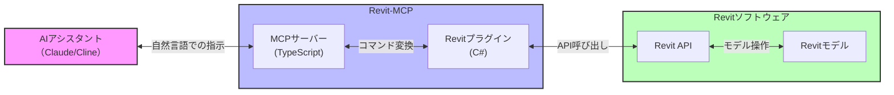

## Revit-MCPの構成

Revit-MCPは主に2つのコンポーネントから構成されています：

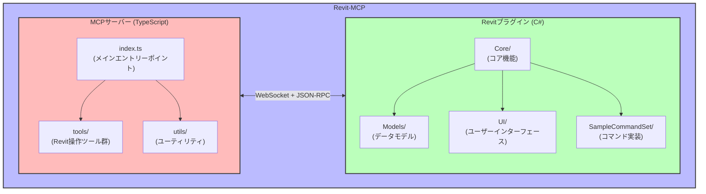

## Revit-MCPでできること

Revit-MCPを使うと、AIアシスタントは以下のようなことができるようになります：

### 1. Revitプロジェクトの情報を取得する

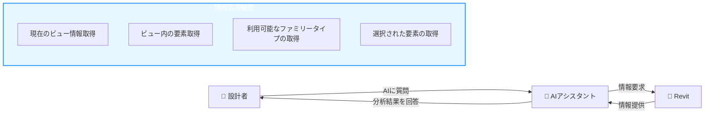

- **現在のビュー情報取得**: アクティブなビューの詳細情報（ビュータイプ、名称、スケールなど）
- **ビュー内の要素取得**: 表示されている要素のリスト（ID、カテゴリ、パラメータなど）
- **利用可能なファミリータイプの取得**: プロジェクト内で使用可能なファミリータイプ（ドア、窓、壁など）
- **選択された要素の取得**: ユーザーが選択した要素の詳細情報

### 2. Revitに要素を作成する

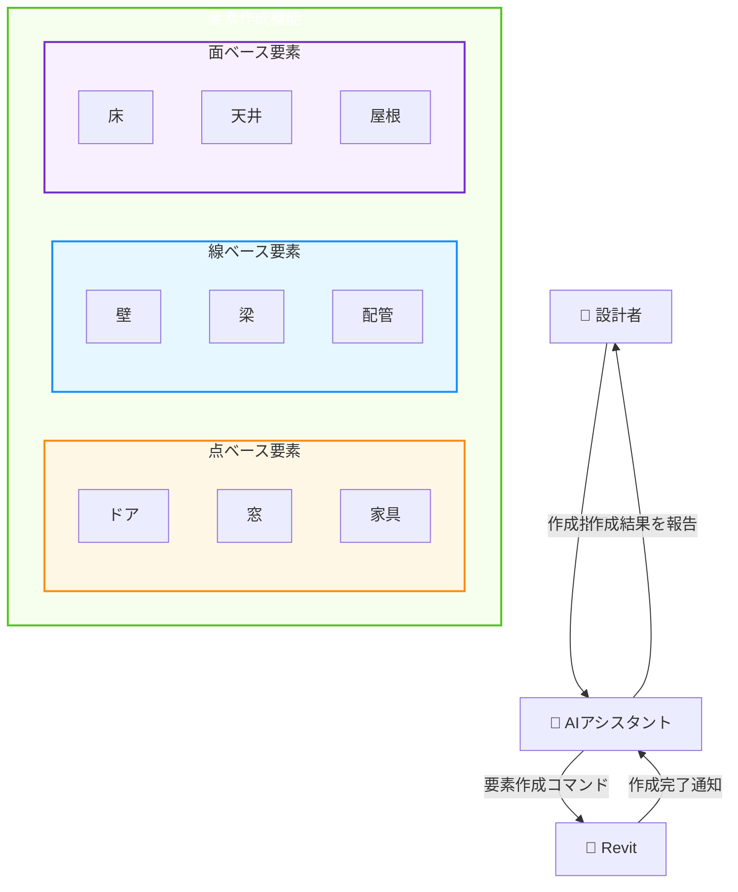

#### 点ベース要素
- **対象**: ドア、窓、家具など
- **パラメータ**: 位置座標、幅、高さ、回転角度など
- **特徴**: 単一の点を基準に配置される要素

#### 線ベース要素
- **対象**: 壁、梁、配管など
- **パラメータ**: 始点・終点座標、厚さ、高さなど
- **特徴**: 線（2点間）を基準に配置される要素

#### 面ベース要素
- **対象**: 床、天井、屋根など
- **パラメータ**: 境界線（閉じたループ）、厚さなど
- **特徴**: 面（閉じた境界線）を基準に配置される要素

### 3. Revitの要素を操作する

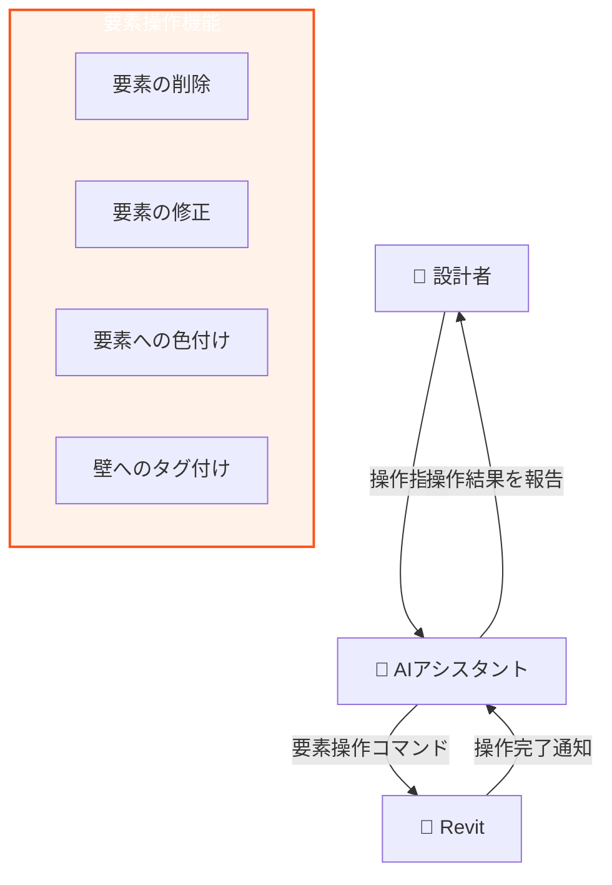

- **要素の削除**: 指定したIDの要素をモデルから削除
- **要素の修正**: 要素のプロパティ（インスタンスパラメータ）を変更
- **要素への色付け**: パラメータ値に基づいて要素に色を付ける（例：部屋の面積によるヒートマップ）
- **壁へのタグ付け**: ビュー内のすべての壁に自動的にタグを付ける

### 4. カスタムコードを実行する

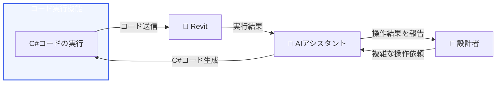

- **C#コードの実行**: AIが生成したC#コードをRevitに送信して実行
- **複雑な操作**: 標準ツールでは難しい複雑な操作を実現
- **カスタム機能**: プロジェクト固有の要件に対応したカスタム機能の実装

## 意匠設計者にとってのメリット

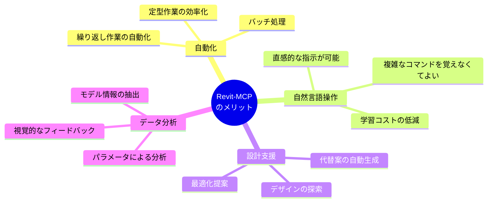

### 1. 繰り返し作業の自動化

「3階から10階まで同じ間取りの部屋を作成して」といった指示をAIに出せば、AIがRevitで自動的に作成してくれます。これにより、単調な繰り返し作業から解放され、創造的な設計作業に集中できます。

### 2. 自然言語での操作

「この壁の高さを3mに変更して」「すべての窓の幅を1.2mにして」といった自然な言葉でRevitを操作できます。複雑なコマンドやショートカットを覚える必要がなく、Revitの操作に不慣れな方でも直感的に使えます。

### 3. 設計支援と提案

「この部屋に適切な窓の配置を提案して」といった依頼に対して、AIが実際にRevitモデル上で窓を配置し、視覚的に提案してくれます。複数の代替案を短時間で生成し、比較検討することも可能です。

### 4. データ分析と可視化

「すべての部屋の面積を計算して、20㎡未満の部屋を赤色で表示して」といった分析も、AIに任せることができます。データに基づいた意思決定をサポートし、設計の質を向上させます。

## 実際の使用例

### 例1：壁の作成

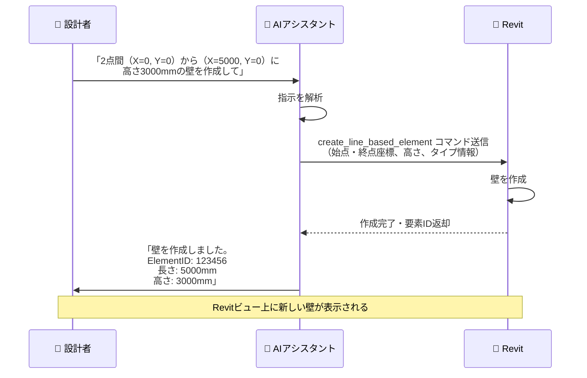

### 例2：要素の分析と色付け

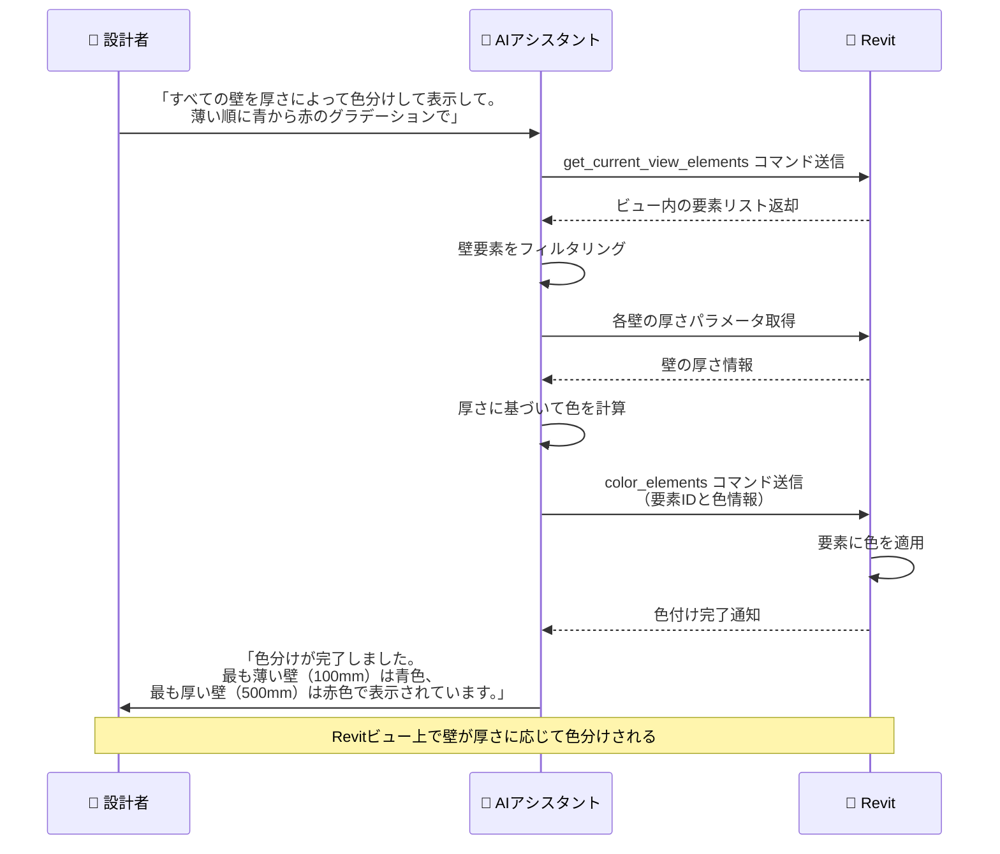

### 例3：複数の窓の一括配置

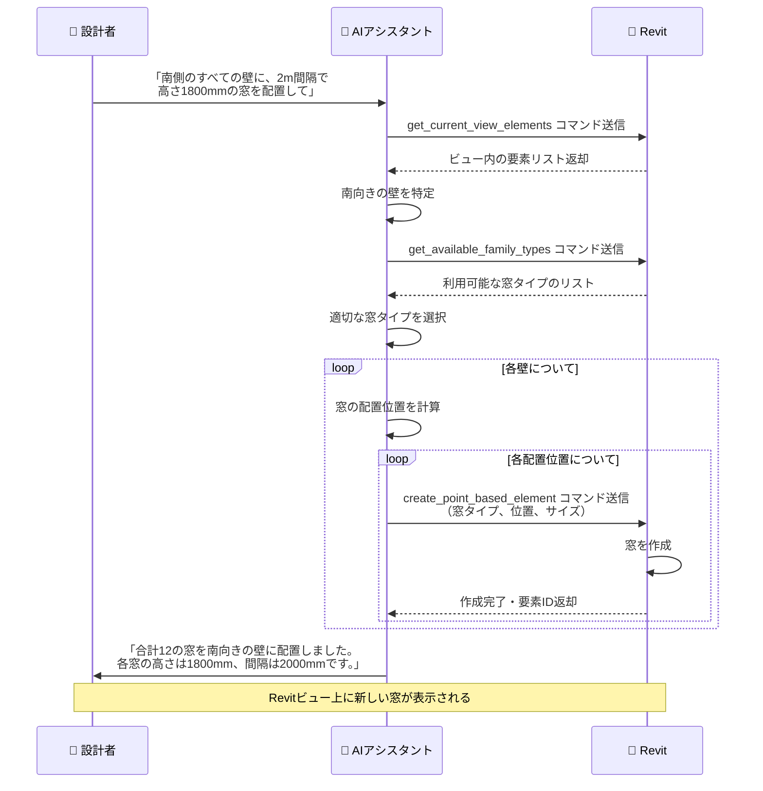

### 例4：部屋の面積分析

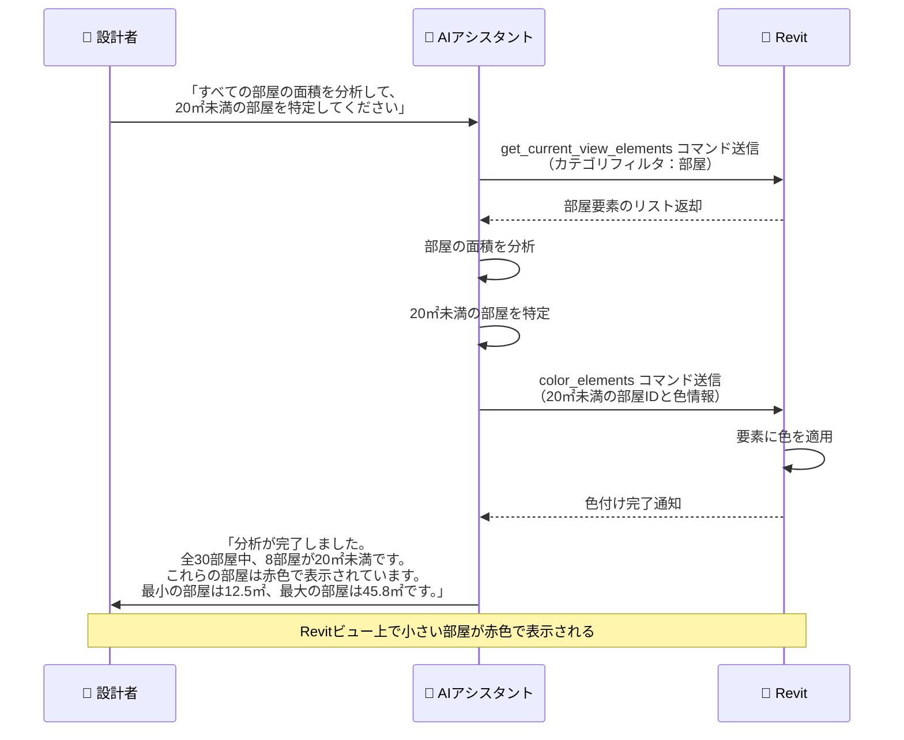

## 技術的な仕組み

Revit-MCPの処理フローを詳しく見てみましょう：

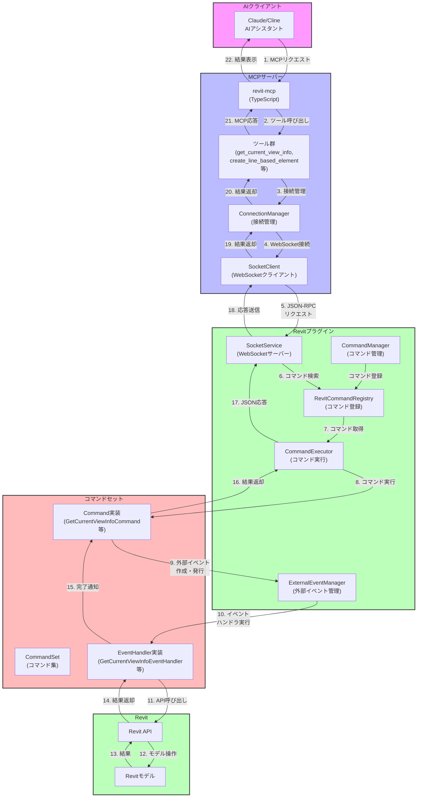

### 処理の流れ（シンプル版）

1. **AIからの指示**: ユーザーがAIに「壁を作成して」などの指示を出します
2. **MCPサーバーでの処理**: AIからの指示がMCPサーバーに送られ、Revitコマンドに変換されます
3. **Revitプラグインでの実行**: コマンドがRevitプラグインに送られ、Revit API経由で実行されます
4. **結果の返却**: 実行結果がAIに返され、AIがユーザーに結果を報告します

## セットアップ方法（詳細）

Revit-MCPを使うための具体的な手順を説明します：

### 1. MCPサーバーのセットアップ

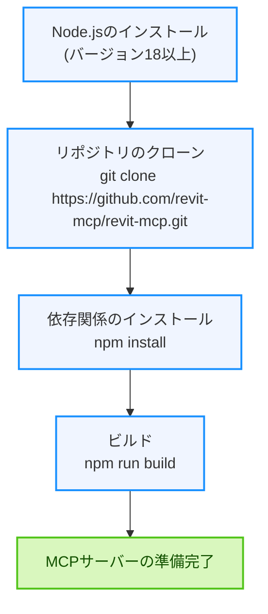

### 2. Revitプラグインのセットアップ

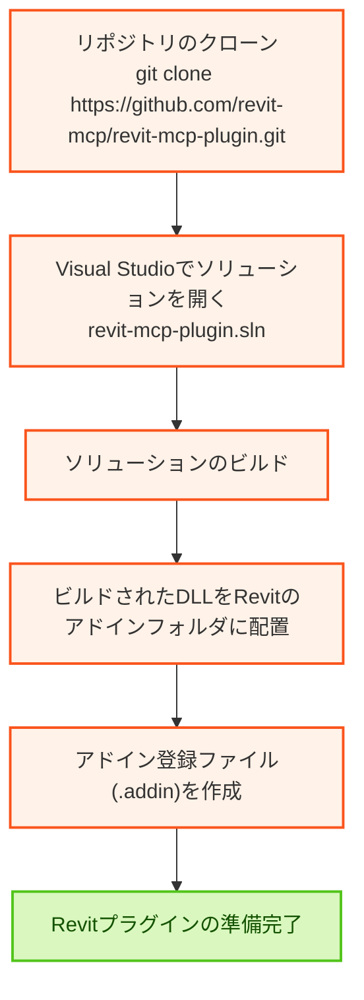

アドイン登録ファイルの例：

```xml
<?xml version="1.0" encoding="utf-8"?>
<RevitAddIns>
  <AddIn Type="Application">
    <Name>revit-mcp</Name>
    <Assembly>%your_path%\revit-mcp-plugin.dll</Assembly>
    <FullClassName>revit_mcp_plugin.Core.Application</FullClassName>
    <ClientId>090A4C8C-61DC-426D-87DF-E4BAE0F80EC1</ClientId>
    <VendorId>revit-mcp</VendorId>
    <VendorDescription>https://github.com/revit-mcp/revit-mcp-plugin</VendorDescription>
  </AddIn>
</RevitAddIns>
```

### 3. AIクライアント（Claude）の設定

Claude設定ファイル（claude_desktop_config.json）に以下を追加します：

```json
{
    "mcpServers": {
        "revit-mcp": {
            "command": "node",
            "args": ["<ビルドされたファイルへのパス>\\build\\index.js"]
        }
    }
}
```

### 4. Revitでのプラグイン設定

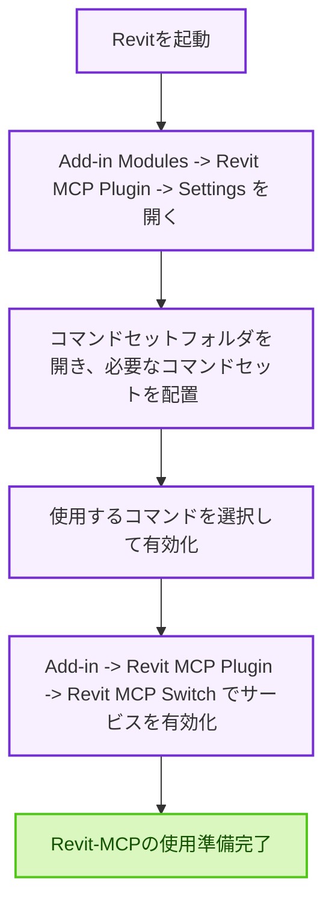

## 実装の特徴

Revit-MCPの実装には、以下のような特徴があります：

### MCPサーバー側の特徴

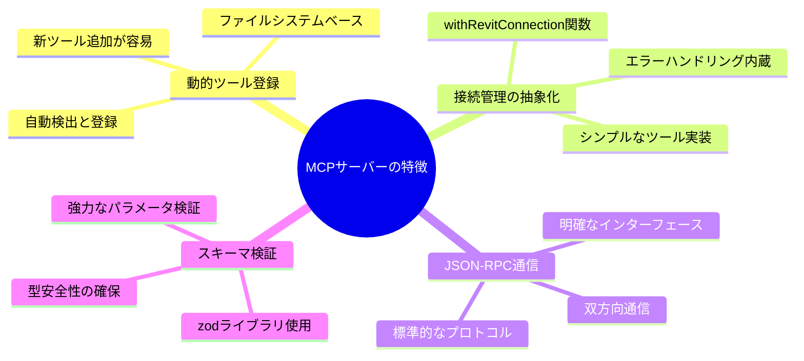

- **動的ツール登録**: ファイルシステムベースの動的ツール登録により、新しいツールの追加が容易です
- **接続管理の抽象化**: `withRevitConnection`関数による接続管理の抽象化で、各ツールの実装がシンプルになっています
- **JSON-RPC通信**: 標準的なJSON-RPCプロトコルを使用した明確な通信インターフェースを提供しています
- **スキーマ検証**: zodライブラリによる強力なパラメータスキーマ検証で、入力エラーを防止します

### Revitプラグイン側の特徴

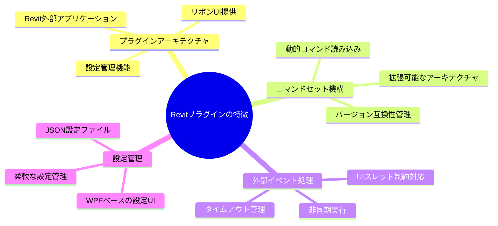

- **プラグインアーキテクチャ**: Revitの外部アプリケーションとして実装され、リボンUIを提供します
- **コマンドセット機構**: 動的にコマンドセットを読み込み、拡張可能なアーキテクチャを実現しています
- **外部イベント処理**: Revit APIの制約に対応するための外部イベントメカニズムを実装しています
- **設定管理**: WPFベースの設定UIとJSON設定ファイルによる柔軟な設定管理を提供しています

## 注意点と制限事項

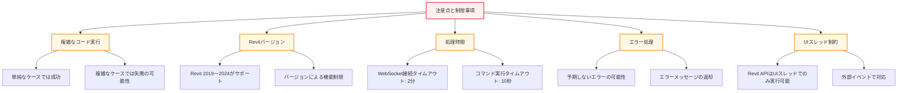

- **複雑なコード実行**: AIが生成したC#コードは、単純なケースでは成功しますが、複雑なケースでは失敗することがあります
- **Revitバージョン**: Revit 2019〜2024がサポートされていますが、バージョンによって一部機能に制限があります
- **処理時間**: WebSocket接続のタイムアウトは2分、コマンド実行のタイムアウトは10秒に設定されており、長時間実行されるコマンドの場合は注意が必要です
- **エラーハンドリング**: 各ツールはエラーをキャッチして適切なメッセージを返しますが、予期しないエラーが発生する可能性があります
- **UIスレッド制約**: Revit APIの多くの操作はUIスレッドでのみ実行可能であり、外部イベントを使用して対応しています

## まとめ：AIとRevitの新しい関係

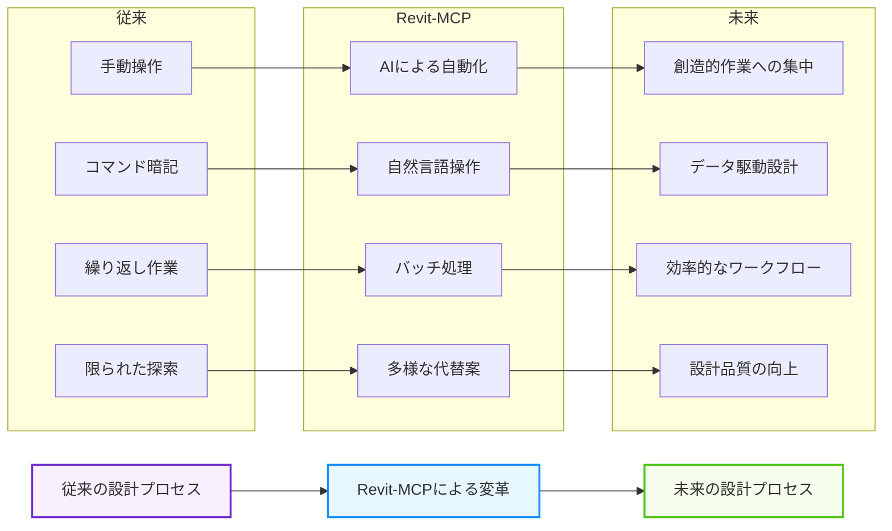

Revit-MCPは、AIとRevitを連携させることで、建築設計のワークフローを大きく変える可能性を秘めています。特に：

- **繰り返し作業の自動化**による時間の節約
- **自然言語でのRevit操作**による学習コストの低減
- **AIによる設計支援と提案**による創造性の向上
- **データ分析と可視化**による意思決定の迅速化

プログラミングの知識がなくても、AIを通じてRevitをより効率的に操作できるようになる—それがRevit-MCPの目指す世界です。

今後、AIと建築設計ツールの連携はさらに進化していくでしょう。Revit-MCPはその先駆けとなる技術であり、意匠設計者の強力な味方になることが期待されます。

## 参考リンク

- [Revit-MCP GitHub](https://github.com/revit-mcp/revit-mcp)
- [Model Context Protocol (MCP)の詳細](https://github.com/anthropic/anthropic-cookbook/tree/main/mcp)
- [Autodesk Revit API ドキュメント](https://www.revitapidocs.com/)